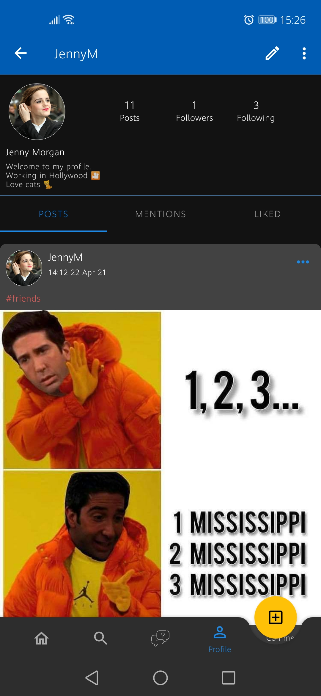
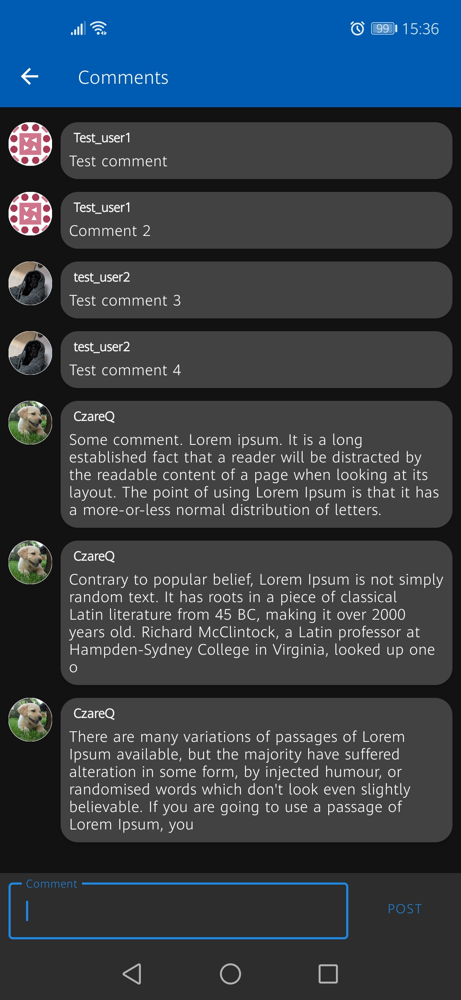
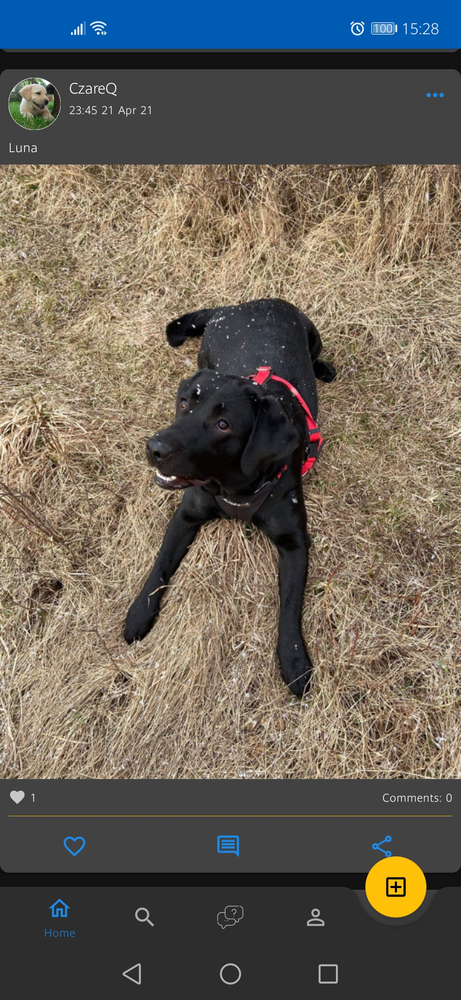
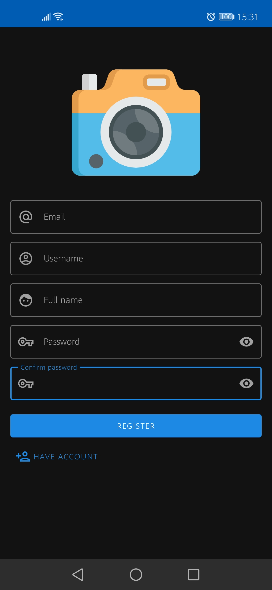
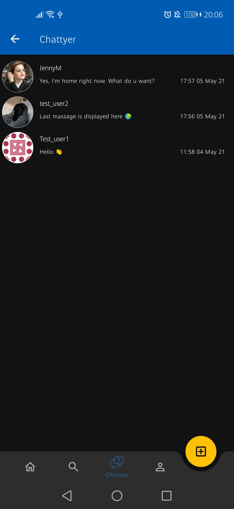
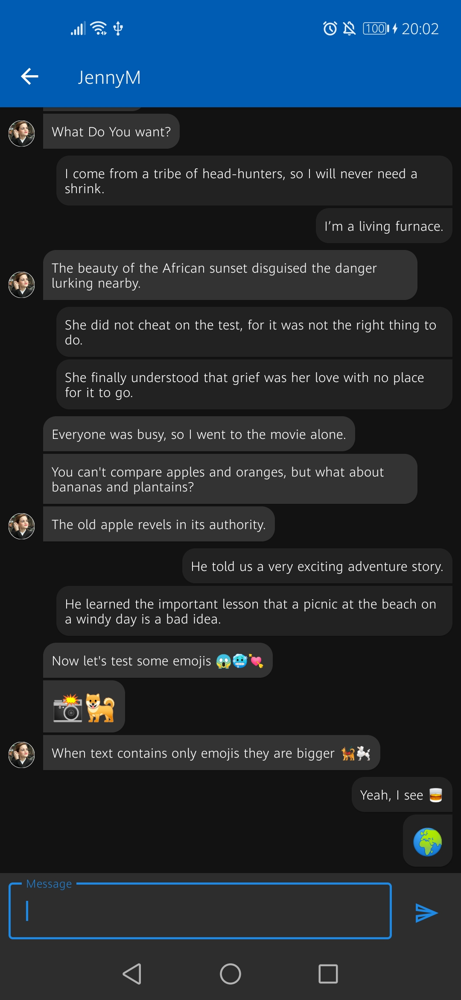

# Pixagram
Social app which allows uploading photos. Written in Kotlin and Firebase.

## Videos from app (not the best quality) 

### Browsing posts

</img>

### Browsing profile

</img>

### Uploading posts

</img>

### Chatting

</img>

## Screenshots from app

### User profile

</img>

### Detailed post

</img>

### Comments

</img>

### Editing profile

</img>

### Left navigation panel

</img>

### Post

</img>

### Registration

</img>

### Last uploads

</img>

### Search user by name/Search posts by hashtag

</img>

</img>

### Uploading new photo

</img>

### Chattyer

</img>
</img>

## App supports light theme:

</img>
</img>
